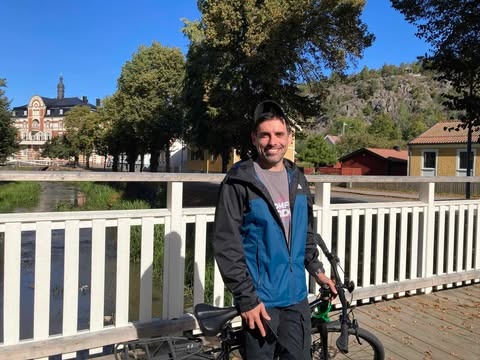

# 🚀 Evangelos Gallos - Portfolio Website <em>"An exercise for the first part of the Meta Front-End Development Professional Certification."</em>

Welcome to my **portfolio website**, built as a practical exercise and hands-on experience in **Front-End Development**.  
This project was created as part of my learning journey, showcasing my skills in **HTML, CSS, Bootstrap, and JavaScript**, while also integrating best practices for responsive design.  

🔗 **Live Website:** [www.evgallos.com](https://www.evgallos.com)  

---

## 🌟 About This Project  

This website serves as my personal **portfolio and bio**, where I highlight my expertise as a **Front-End Developer** and **UI/UX Designer**.  
It was an exciting opportunity to apply my knowledge in real-world web development and improve my skills in modern front-end technologies.  

---

## 🛠️ Tech Stack  

- **HTML5**: Structuring the content  
- **CSS3 & Bootstrap**: Styling and responsive design  
- **JavaScript**: Interactive components  
- **GitHub Pages**: Hosting the project  

---

## ✨ Code Highlights  

### 🔹 Navigation Bar  

```html
<nav class="navbar navbar-expand navbar-dark bg-dark">
    <div class="nav navbar-nav">
        <a class="nav-item nav-link active" href="#">Home <span class="sr-only">(My Bio via Meta Certification)</span></a>
        <a class="nav-item nav-link" href="https://www.evgallos.com">My Real Webpage</a>
    </div>
</nav>

🔹 Responsive Image & Bio Section
html
Copy
Edit
<div class="row align-items-center">
    <div id="bio" class="col-12 col-md-4 text-center">
        <h1>Evangelos Gallos</h1>
        
    </div>
</div>

🔹 Custom CSS Styling
css
Copy
Edit
#more {
    float: right;
    margin-top: 0;
    padding-top: 0;
}

body {
    font-family: monospace;
}

h2:hover {
    color: limegreen;
}

li:hover {
    color: limegreen;
}


🎯 Key Learnings
✅ Implementing Bootstrap Grid for responsiveness
✅ Creating an accessible and well-structured navigation bar
✅ Practicing real-world front-end development with clean, maintainable code
✅ Adding custom CSS effects for better user experience

This project was a great hands-on experience, and I plan to continue expanding my knowledge in React and JavaScript in upcoming projects! 🚀

📌 Future Improvements
🔹 Adding React.js components for a more dynamic experience
🔹 Enhancing UI with custom CSS animations
🔹 Improving SEO & performance

📩 Let's Connect!
💼 Portfolio: www.evgallos.com
💬 LinkedIn: linkedin.com/in/evangelos-gallos


If you're looking for a Front-End Developer or Internship Opportunities, feel free to reach out! 😃

🔥 #FrontEnd #WebDevelopment #Bootstrap #JavaScript #HTML #CSS #Portfolio #React #UIUX
markdown
Copy
Edit
